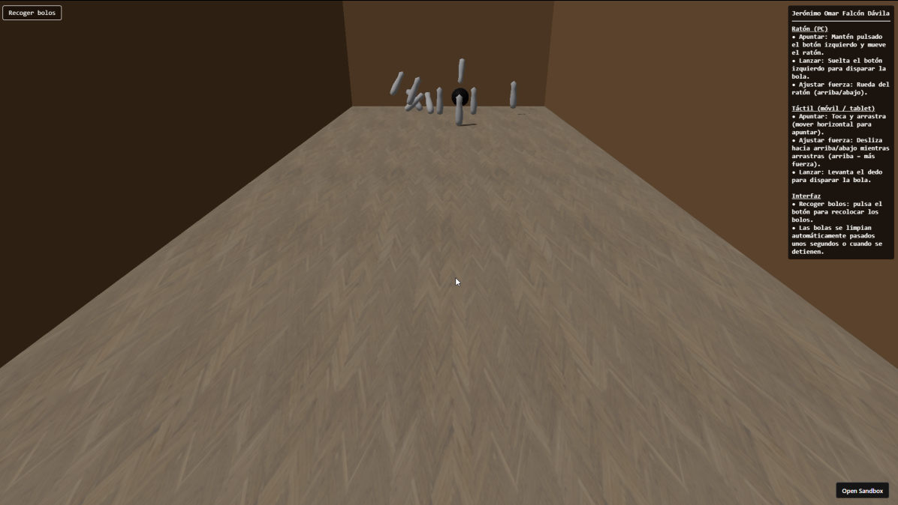

# Entregable semana 11: animación

## Índice

- [Índice](#índice)
- [Introducción](#introducción)
- [Entorno](#entorno)
- [Controles](#controles)
- [Tweens](#tweens)
- [Ammo.js](#ammojs)
- [Audio](#audio)
- [Resultado final](#resultado-final)

## Introducción

Se nos pide desarrollar un prototipo three.js de temática libre que integre la biblioteca tween.js y/o el motor de física ammo.js.

Ya que la tématica era libre se me ocurrió hacer una bolera, para tener tanto como tween.js como ammo.js. Para ello, me pareció correcto coger de base el script visto en clase [script_45_ammo.js](https://github.com/otsedom/otsedom.github.io/blob/main/IG/S11/code/script_45_ammo.js).

## Entorno

Para el entorno se creo una habitación cerrada que simula una sala de bowling, en esta **la cámara no se puede mover** (para que no interfiera con los controles).

Destacar que todas las paredes tienen físicas y el suelo tiene textura, esta textura está vinculada a la siguiente [URL](https://dl.polyhaven.org/file/ph-assets/Textures/jpg/2k/herringbone_parquet/herringbone_parquet_diff_2k.jpg).

Se usa también una función que le dan forma a los bolos para que no tengan una forma muy genérica.

## Controles

Aunque aparecen en la aplicación, quiero hacer mención sobre los controles ya que estos se han adaptado tanto para **ordenador** como para **móvil/tablet**:

Para el **ratón**:

- **Apuntar**: Mantén pulsado el botón izquierdo y mueve el ratón.
- **Lanzar**: Suelta el botón izquierdo para disparar la bola.
- **Ajustar fuerza**: Rueda del ratón (arriba/abajo).

Para **pantallas táctiles**:

- **Apuntar**: Tocar y arrastrar (mover horizontal para apuntar).
- **Ajustar fuerza**: Deslizar hacia arriba/abajo mientras arrastras (arriba = más fuerza)
- **Lanzar**: Levanta el dedo para disparar la bola.

## Interfaz

Simplemente hay un botón a arriba a la izquierda que sirve para resetear los bolos. Adicionalmente a esto, están los controles en la parte derecha.

## Tweens

Puse varias animaciones de tweens, en esta se setea la cámara en una posición.

```
new Tween(camera.position, tweenGroup)
    .to(
        {
        x: 0,
        y: 3,
        z: 2,
        },
        800
    )
    .easing(Easing.Cubic.Out)
    .onUpdate(() => {
        controls.update();
    })
    .start();
```

En este trozo los bolos desaparecen cuando tocan el suelo.

```
// Animación: caer al suelo (desaparecen)
new Tween(mesh.position, tweenGroup)
    .to({ y: groundY }, 600)
    .delay(i * 60)
    .easing(Easing.Cubic.In)
    .onComplete(() => {
    // Elimina el objeto al tocar suelo
    scene.remove(mesh);
    })
    .start();

new Tween(mesh.rotation, tweenGroup)
    .to({ x: Math.PI * 2, z: Math.PI }, 600)
    .delay(i * 60)
    .easing(Easing.Cubic.In)
    .start();
```

Y por último, en este trozo los bolos hacen una animación de bajada suave desde arriba.

```
new Tween(mesh.position, tweenGroup)
    .to(
        {
        x: pin.startPos.x,
        y: pin.startPos.y,
        z: pin.startPos.z,
        },
        700
    )
    .easing(Easing.Cubic.Out)
    .onComplete(() => {
        if (index === pins.length - 1) inputBlocked = false;
    })
    .start();

new Tween(mesh.rotation, tweenGroup)
    .to({ x: 0, y: 0, z: 0 }, 600)
    .easing(Easing.Cubic.Out)
    .start();
```

## Ammo.js

Ammo.js se usa en el proyecto para:

- **Crear el mundo físico** donde existen gravedad y colisiones
- Convertir los objetos 3D en “cuerpos rígidos” con masa, forma y fricción.
- **Simular movimiento**, **colisiones de bolas y bolos** cada frame
- **Actualizar la posición y rotación** de los objetos 3D
- **Permitir interacciones realistas**, como que la bola empuje los bolos y estos caigan.

En resumen, para el proposito de crear la bolera viene genial, ya que la física que necesitamos ya viene integrada en la líbreria.

## Audio

Se añadió una pista de audio que se escucha cuando la bola está en movimiento e impacta con los bolos.

# Resultado final

El resultado final se puede ver en el siguiente vídeo (haz click en la imagen para descargarlo) [](Grabación%202025-12-04%20225551.mp4)
